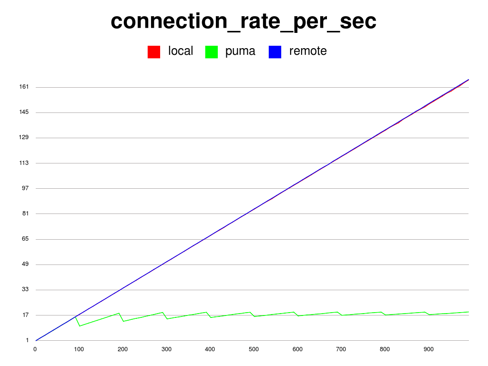
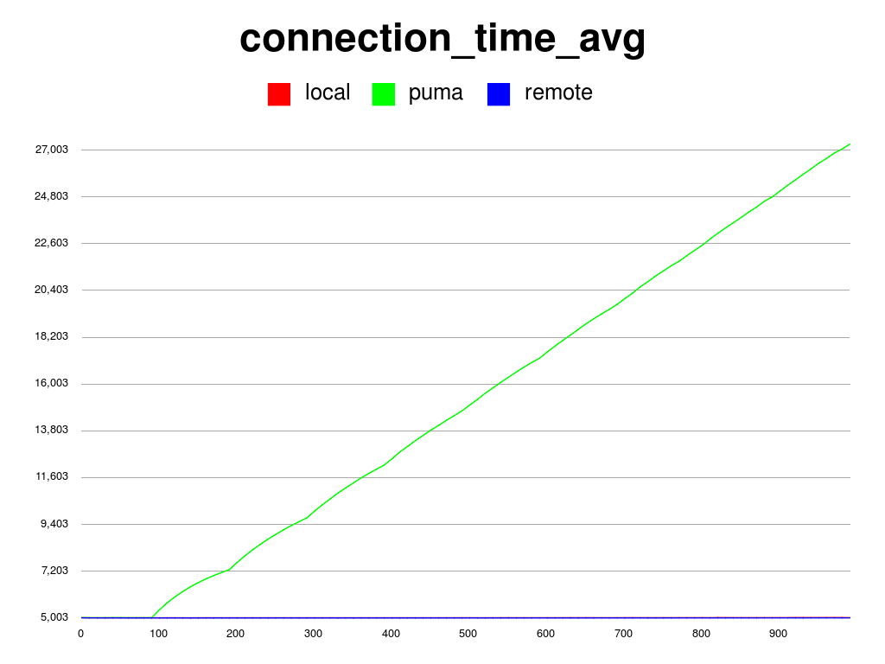
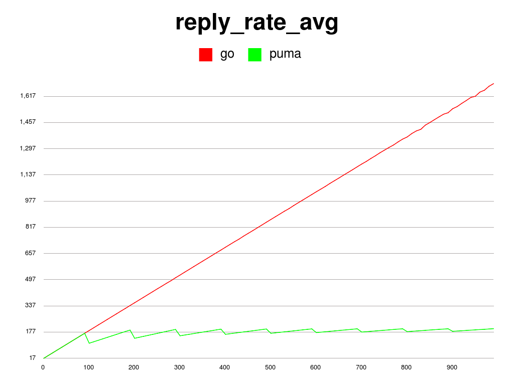
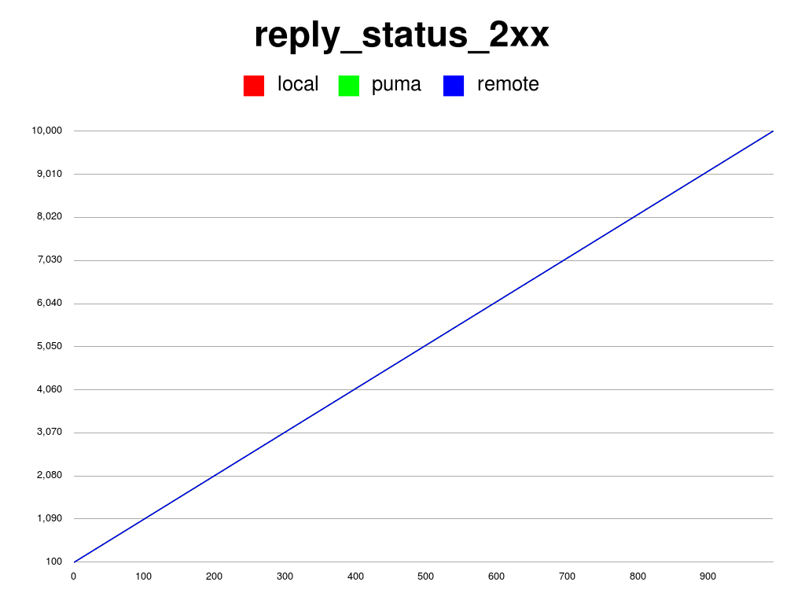
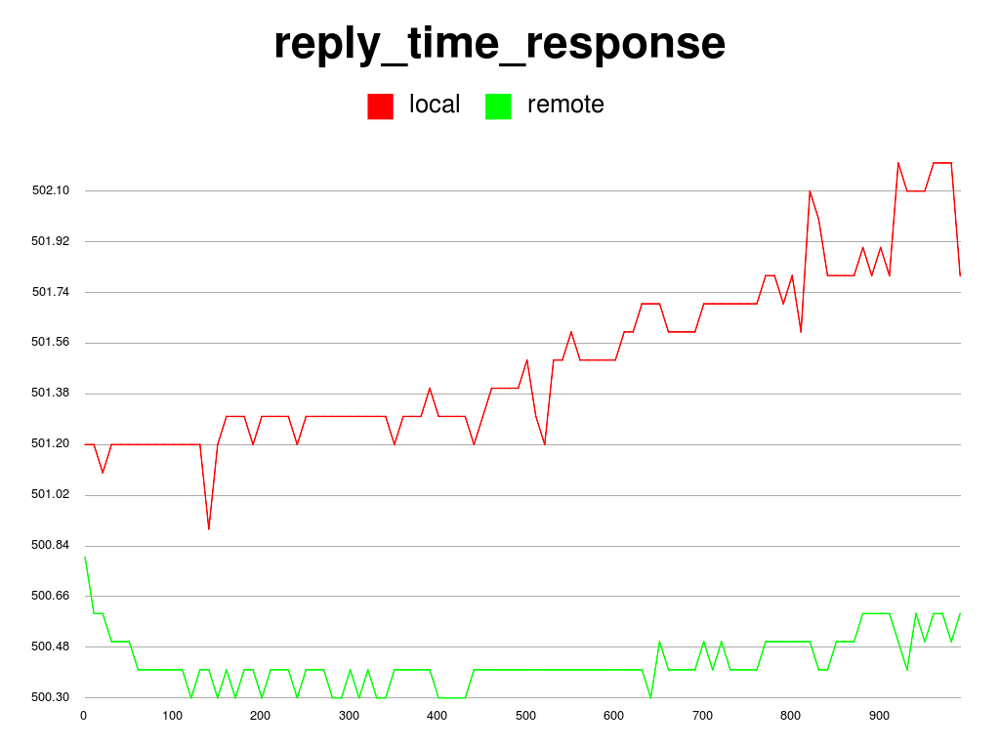
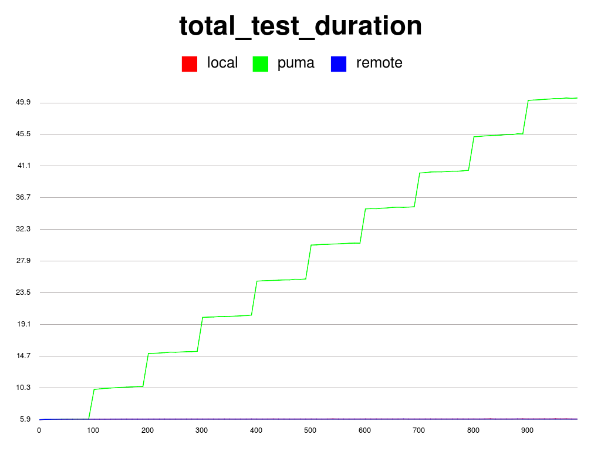

# Performance testing on a basic Go web application

Testing the performance of a simple Go web application.

### Connection rate per sec

The rate of connections being initiated per second.

### Connection time average

The average lifetime for successful connections which is the time between connection initiation and the time the connection is closed. A connection is considered successful if it had at least one call that completed successfully.

### Reply rate average

The average rate of replies from the server. 

### Number of successful replies

The number of successful replies (2xx) from the server. 

### Reply response time

The average time for the server to respond to a request.

### Total test duration

This is how long it took to do the test.

