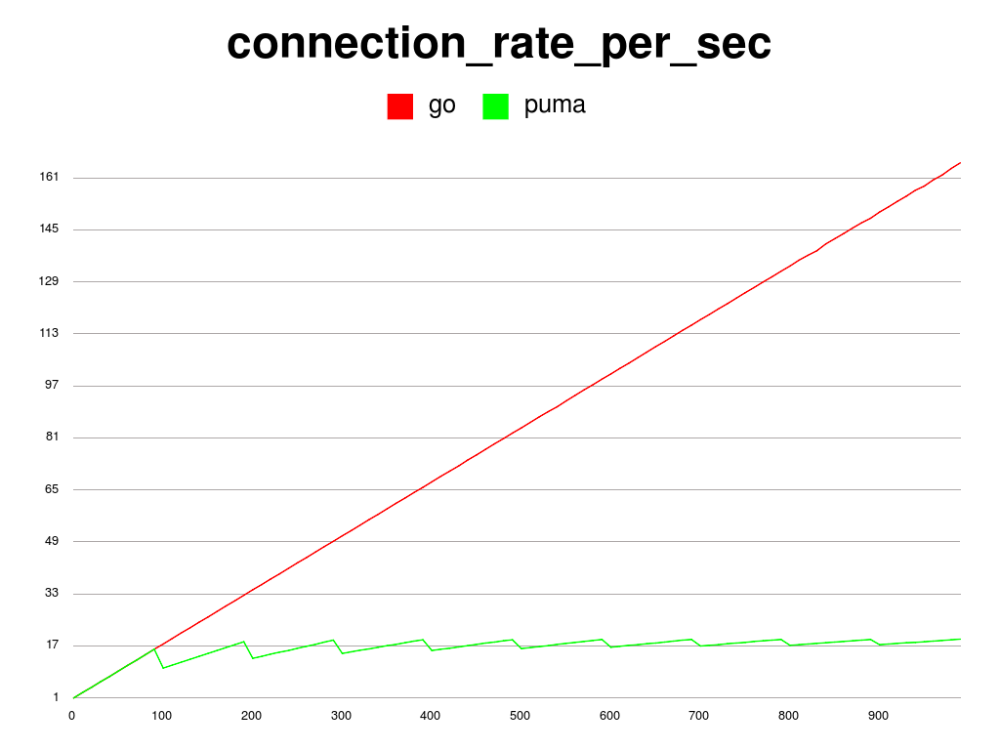
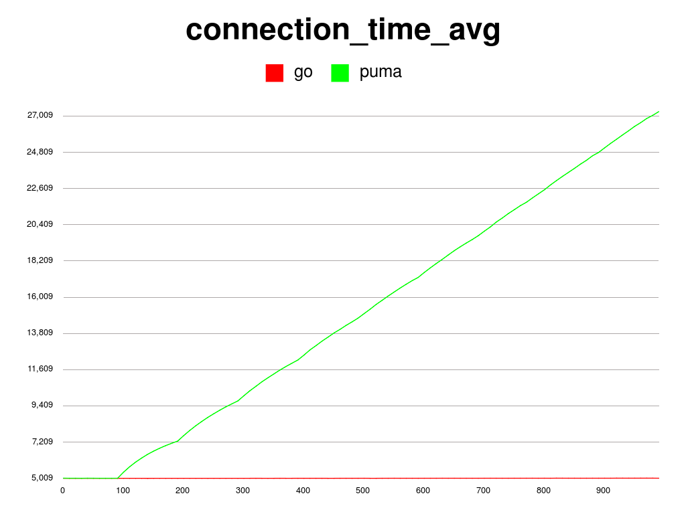
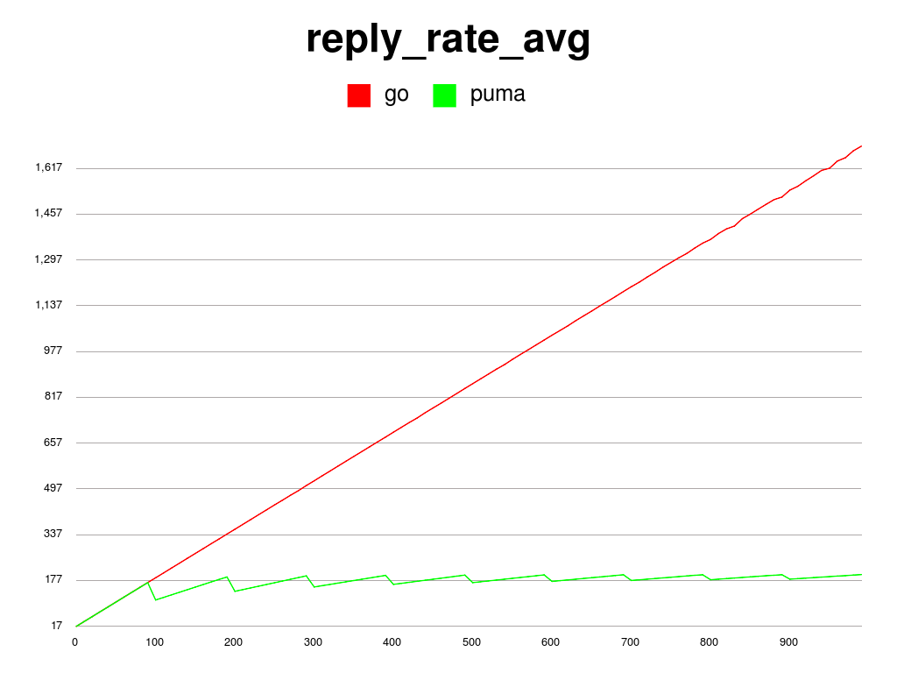
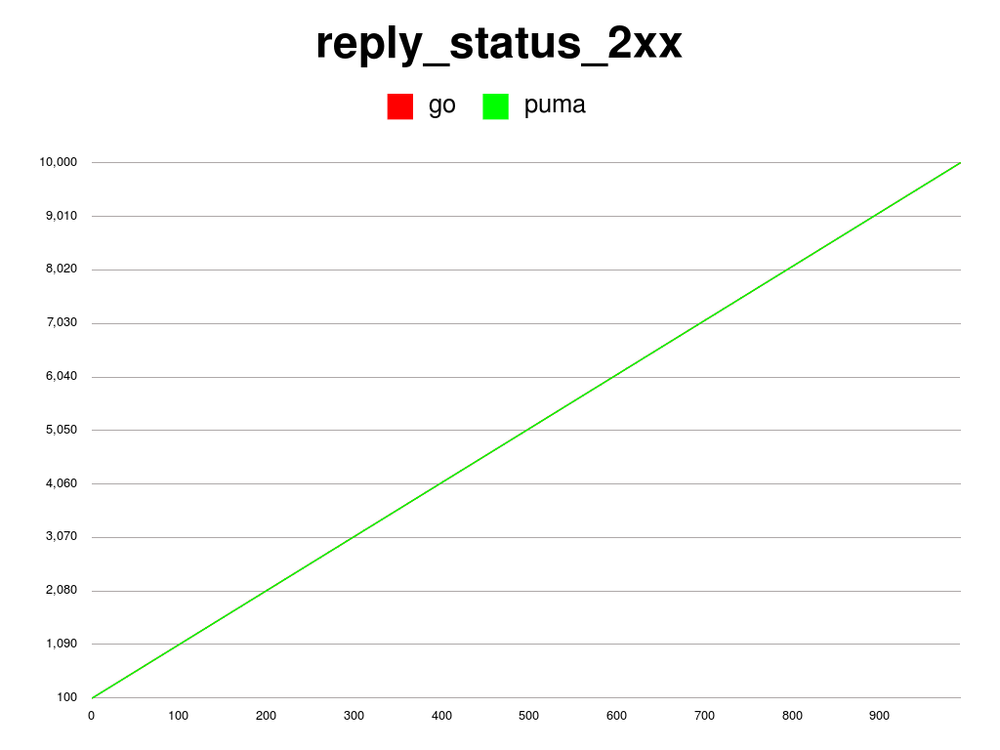
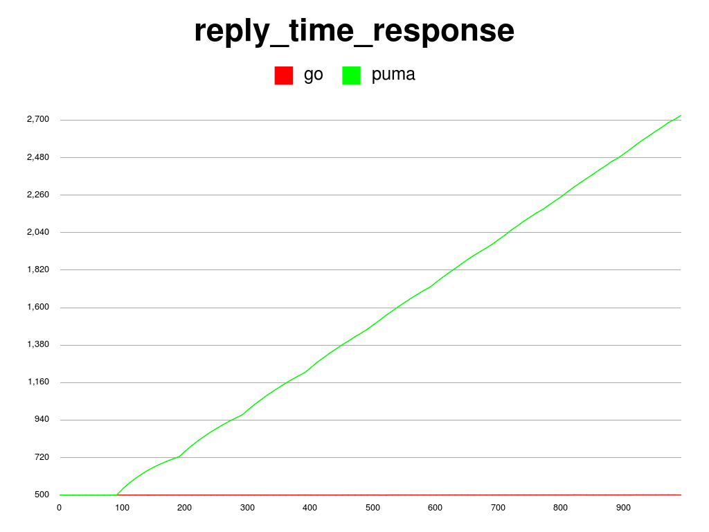
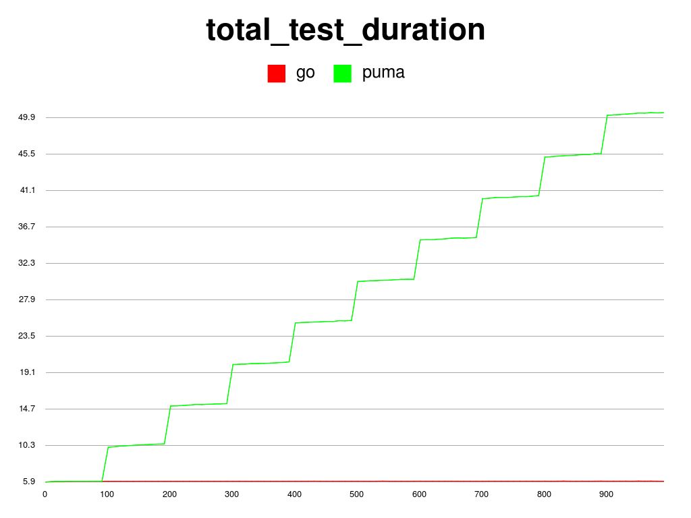

# Performance testing on a basic Go web application

Testing the performance of a simple Go web application.

## Code

Go web application code.

```go
package main

import (
  "fmt"
  "time"
  "net/http"
)

func work(w http.ResponseWriter, r *http.Request) {
  time.Sleep(500 * time.Millisecond)
  fmt.Fprintf(w, "<h1>Hello Perf</h1>")
}

func main() {
  http.HandleFunc("/perf", work)
  http.ListenAndServe("0.0.0.0:8080", nil)
}

```

Puma-Ruby web application code.

```ruby
require 'sinatra'
configure { set :port, 8080 }

get "/perf" do  
  sleep 0.5
  "<h1>Hello Perf</h1>"
end
```

## Test

The test uses httperf, which sends n number of requests at the same time to the server. I step through n from 10 to 1000. This means the we start off at 10 requests at the same time to the server, and incrementally add 10 requests until we reach 1000 requests sent to the server at the same time. For consistency I perform each step 10 times.

## Environment

I tested this on Ubuntu 14.04 as a guest running on a VirtualBox VM, with 8GB RAM and 4 VCPUs. The host OS is OS X Mavericks running on an MBP with 16GB RAM.

## Results

### Connection rate per sec

The rate of connections being initiated per second. 

Go spins off new goroutines whenever a connection is made, so the rate of creating connections is proportionate to the rate of requests being made. 

Puma has a min of 10 threads and a max of 100 threads so the rate of creating new connections have an upper limit. When that limit is reached, the connection rate plateaus.



### Connection time average

The average lifetime for successful connections which is the time between connection initiation and the time the connection is closed. A connection is considered successful if it had at least one call that completed successfully.

Go spins off new goroutines when needed, so the average connection time remains the same.

Puma has an upper limit of 100 threads, when that limit is reached, the connection time slows and becomes proportionate the the number of requests.




### Reply rate average

The average rate of replies from the server. 

Go spins off new goroutines when needed, so the rate of reply is consistent and remains the same throughout.

Puma has an upper limit of 100 threads, so when that limit is reached, the reply rate plateaus.



### Number of successful replies

The number of successful replies (2xx) from the server. 

Go and Puma both return success replies for all the requests.




### Reply response time

The average time for the server to respond to a request.

Go spins off new goroutines when needed, so the reply response time is consistent and remains the same throughout.

Puma has an upper limit of 100 threads, so when that limit is reached, the reply response times increases proportionately the number of requests.




### Total test duration

This is how long it took to do the test.

